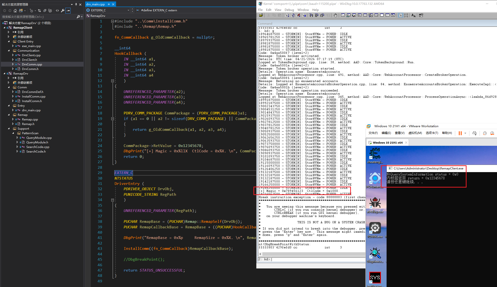
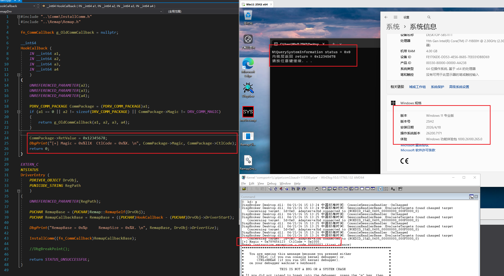

# RemapDrv

English | [中文文档](README.zh-CN.md)

> A Windows x64 driver communication research project that explores a relatively covert communication path between R3 and R0 by remapping the driver image and taking over a target system-call callback pointer.

## 1. Project Name

**RemapDrv**

## 2. Overview

`RemapDrv` demonstrates a driver communication approach based on system-call callback hijacking. The repository includes both a kernel-mode driver sample and a user-mode console sample, covering the following core parts:

- Driver self-remapping and relocation, where common manual scans and some ARK tools may fail to locate the driver module information
- Callback installation and basic communication dispatch testing
- R3-side communication package wrapping and control-code invocation

The figure below shows the communication hook point used by this project:


## 3. Features / Usage Example

### Driver Entry

The driver entry first remaps its own image into a new memory region, then calculates the remapped callback address and installs the communication callback.

Source: `RemapDrv/Entry/drv_main.cpp`

```cpp
EXTERN_C
NTSTATUS
DriverEntry(
    PDRIVER_OBJECT DrvObj,
    PUNICODE_STRING RegPath
    )
{
    UNREFERENCED_PARAMETER(RegPath);

    PUCHAR RemapBase = (PUCHAR)Remap::RemapSelf(DrvObj);
    PUCHAR RemapCallbackBase = RemapBase + ((PUCHAR)HookCallback - (PUCHAR)DrvObj->DriverStart);

    InstallComm((fn_CommCallback)RemapCallbackBase);
    return STATUS_UNSUCCESSFUL;
}
```

### Communication Callback

The callback validates the communication package, checks the custom `Magic` and `CtlCode`, and forwards non-target calls to the original callback.

Source: `RemapDrv/Entry/drv_main.cpp`

```cpp
__int64
HookCallback(
    IN __int64 a1,
    IN __int64 a2,
    IN __int64 a3,
    IN __int64 a4
    )
{
    PDRV_COMM_PACKAGE CommPackage = (PDRV_COMM_PACKAGE)a1;
    if (a1 == 0 || a2 != sizeof(DRV_COMM_PACKAGE) || CommPackage->Magic != DRV_COMM_MAGIC)
    {
        return g_OldCommCallback(a1, a2, a3, a4);
    }

    CommPackage->RetValue = 0x12345678;
    return 0;
}
```

### R3 Invocation Example

The user-mode console sample packages and sends a control request through `DrvClient::SendCtl(...)`.

Source: `RemapClient/exe_main.cpp`

```cpp
std::array<UCHAR, 0x100> Buffer = {};
ULONG RetValue = 0;

const NTSTATUS Status = Client.SendCtl(
    0x1000,
    Buffer.data(),
    static_cast<ULONG>(Buffer.size()),
    &RetValue
);
```

### Communication Package Format

The data structure exchanged between R3 and R0 is defined as follows:

Source: `RemapDrv/Comm/DrvCommDef.h`

```cpp
typedef struct _DRV_COMM_PACKAGE
{
    ULONG64 Magic;
    ULONG CtlCode;
    PVOID Buffer;
    ULONG BufferSize;
    ULONG RetValue;
} DRV_COMM_PACKAGE, *PDRV_COMM_PACKAGE;
```

## 4. Supported Environment

### Tested System Versions

- Windows 10 19044
- Windows 11 22H2
- Windows 11 24H2
- Windows 11 25H2

### Communication Test Screenshots

Windows 10 19044:



Windows 11 25H2:



### Expected Compatibility Range

At the moment, validation has only been completed on the virtual-machine environments listed above. Based on the current version branches and signature-matching logic in the code, the project is theoretically expected to support:

- Windows 10 19041 ~ Windows 11 25H2

Actual compatibility should still be verified on the target system.

## 5. Build

### Build Environment

- Visual Studio 2017
- WDK 10
- `x64` only

### Build Steps

1. Open `RemapDrv.sln` with Visual Studio 2017.
2. Select `x64` as the target platform.
3. Build the `RemapDrv` driver project.
4. Build the `RemapClient` console project.

## 6. Repository Layout

```text
.
+-- Image/
|   +-- HookComm.png
|   +-- CommTest_19044.png
|   +-- CommTest_25H2.png
+-- RemapClient/
|   +-- exe_main.cpp              Invocation entry example
|   +-- DrvClient.cpp/.h          User-mode communication wrapper
|   +-- DrvComm.cpp/.h            Low-level sending logic
+-- RemapDrv/
|   +-- Entry/                    DriverEntry and HookCallback
|   +-- Comm/                     Communication installation and packet definitions
|   +-- Remap/                    Driver self-remapping logic
|   +-- Support/PatternScan/      Module lookup and signature scanning helpers
+-- RemapDrv.sln
```
