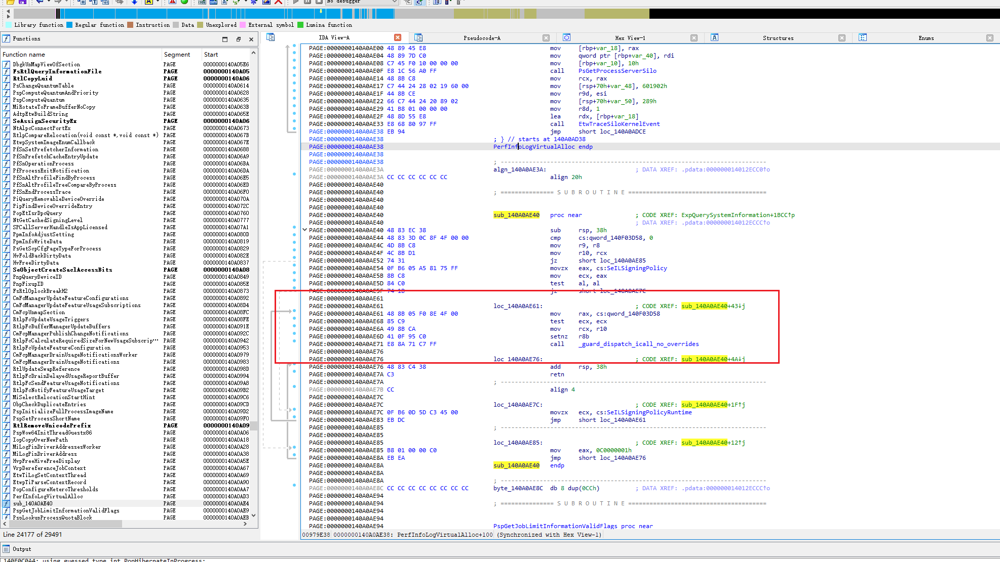

# RemapDrv

[English](README.md) | 中文文档

> 面向 Windows x64 的驱动"隐蔽"通信研究项目，通过重映射驱动镜像并接管目标系统调用回调指针，在 R3 与 R0 之间建立一条较为隐蔽的"无痕"通信路径。

## 1. Project Name

**RemapDrv**

## 2. Overview

`RemapDrv` 演示了一种基于系统调用回调劫持的驱动通信思路。项目包含内核侧驱动样例与用户态控制台样例，覆盖了以下几个核心环节：

- 驱动自重映射与重定位，此时常规扫描手动、ARK工具无法找到驱动模块信息
- 回调安装与简单的通信分发测试
- R3 侧通信包封装与控制码调用

下图为劫持通讯实现点：



## 3. Features / Usage Example

### 驱动入口

驱动入口会先将自身镜像重映射到新的内存区域，再计算重映射后回调函数的地址并安装通信回调：

对应源码：`RemapDrv/Entry/drv_main.cpp`

```cpp
EXTERN_C
NTSTATUS
DriverEntry(
    PDRIVER_OBJECT DrvObj,
    PUNICODE_STRING RegPath
    )
{
    UNREFERENCED_PARAMETER(RegPath);

    PUCHAR RemapBase = (PUCHAR)Remap::RemapSelf(DrvObj);
    PUCHAR RemapCallbackBase = RemapBase + ((PUCHAR)HookCallback - (PUCHAR)DrvObj->DriverStart);

    InstallComm((fn_CommCallback)RemapCallbackBase);
    return STATUS_UNSUCCESSFUL;
}
```

### 通信回调

回调函数会检查通信包的合法性，识别自定义 `Magic` 与 `CtlCode`，非目标调用则转发给原始回调：

对应源码：`RemapDrv/Entry/drv_main.cpp`

```cpp
__int64
HookCallback(
    IN __int64 a1,
    IN __int64 a2,
    IN __int64 a3,
    IN __int64 a4
    )
{
    PDRV_COMM_PACKAGE CommPackage = (PDRV_COMM_PACKAGE)a1;
    if (a1 == 0 || a2 != sizeof(DRV_COMM_PACKAGE) || CommPackage->Magic != DRV_COMM_MAGIC)
    {
        return g_OldCommCallback(a1, a2, a3, a4);
    }

    CommPackage->RetValue = 0x12345678;
    return 0;
}
```

### R3 调用示例

用户态控制台程序通过 `DrvClient::SendCtl(...)` 打包并发送控制请求：

对应源码：`RemapClient/exe_main.cpp`

```cpp
std::array<UCHAR, 0x100> Buffer = {};
ULONG RetValue = 0;

const NTSTATUS Status = Client.SendCtl(
    0x1000,
    Buffer.data(),
    static_cast<ULONG>(Buffer.size()),
    &RetValue
);
```

### 通信包格式

R3 与 R0 之间传递的数据包定义如下：

对应源码：`RemapDrv/Comm/DrvCommDef.h`

```cpp
typedef struct _DRV_COMM_PACKAGE
{
    ULONG64 Magic;
    ULONG CtlCode;
    PVOID Buffer;
    ULONG BufferSize;
    ULONG RetValue;
} DRV_COMM_PACKAGE, *PDRV_COMM_PACKAGE;
```

## 4. Supported Environment

### 已测试系统版本

- Windows 10 19044
- Windows 11 22H2
- Windows 11 24H2
- Windows 11 25H2

### 预期兼容范围

由于当前仅在以上虚拟机环境中完成测试，现阶段可以确认的测试结果仅限于上述版本。结合当前代码中的版本分支与特征码处理逻辑，理论上支持：

- Windows 10 19041 ~ Windows 11 25H2

实际兼容性仍建议以目标系统的实测结果为准。

## 5. Build

### 构建环境

- Visual Studio 2017
- WDK 10
- 仅支持 `x64`

### 构建方式

1. 使用 Visual Studio 2017 打开 `RemapDrv.sln`
2. 选择目标平台为 `x64`
3. 编译 `RemapDrv` 驱动项目
4. 编译 `RemapClient` 控制台项目

## 6. Repository Layout

```text
.
├─Image/
│  └─HookComm.bmp
├─RemapClient/
│  ├─exe_main.cpp              调用入口示例
│  ├─DrvClient.cpp/.h          用户态通信封装
│  └─DrvComm.cpp/.h            低层发送逻辑
├─RemapDrv/   
│  ├─Entry/                    DriverEntry 与 HookCallback
│  ├─Comm/                     通信安装与通信包定义
│  ├─Remap/                    驱动自重映射逻辑
│  └─Support/PatternScan/      模块查询与特征码扫描辅助代码
└─RemapDrv.sln
```
